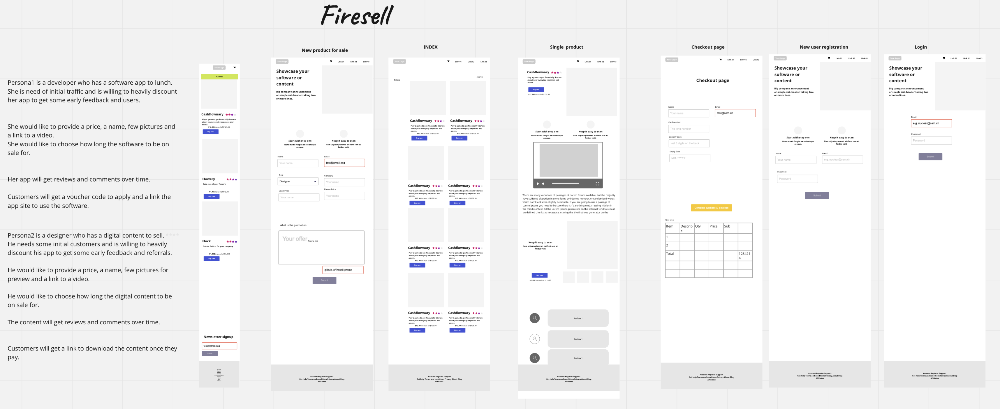
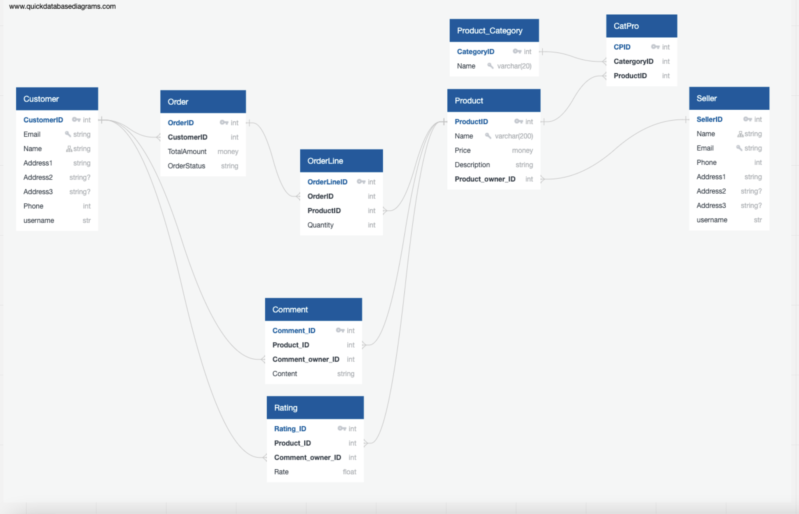

# firesell

## Overview

This is the 4th project as part of the software engineering immersive course at General Assembly London.
The assignment was to create a full-stack website with React and Flask.
The project was to be completed **individually** within **5 days** over 2 weeks, for a total of 30 hours.

Preview: 

## Technologies used 

- Flask
- React
- Marshmallow
- Python
- SQLAlchemy
- HTML
- CSS
- Git and GitHub
- Bcrypt

## Approach

The idea was to make a site where developers and creators can sell software and content. Here are a few stories and wireframes I put together: 

I also did a database diagram:

Association tables for Product / Category and OrderLines took some time due to circular imports and the added Quantity field on the OrderLine. 

## Timeline
- Day 1: Data models
- Day 2: Join and association tables, serializers
- Day 3: Controllers, Secure Route
- Day 4: Controllers, frontend, UI library
- Day 5: Promise.all on the frontend

## Jira setup 

My tickets are marked orange.

### Build:
#### MVP Roadmap

#### Initial Backlog

#### Backlog

#### Stretchgoals

#### MVP done

--------

## Bugs, Wins & Learnings
Many features that were stretch goals were not finished, including search for the whole site, filtering by tags, upvotes for posts.
It was a great project and there is a throve of features that can be added to make it a proper product. 

Working in team is fun and can get a lot done when the group is in sync. 
I personally learned quite a bit about react, router, state and bulma on this project. 

  That way the user will see up-to-date data. 
  Deleting comments and posts in real time using state also improves drastically the UX. 
  I aslo added a show/hide button for the comments so the feed doesn't clutter. 

Final version of the newsfeed:

## Credits
- Logo: Dimitar Vidolov (via canva.com).
--------
